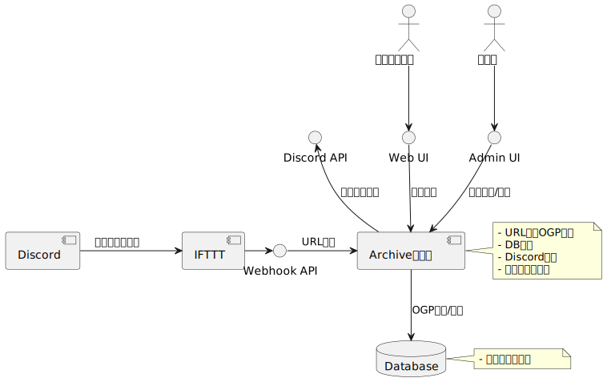
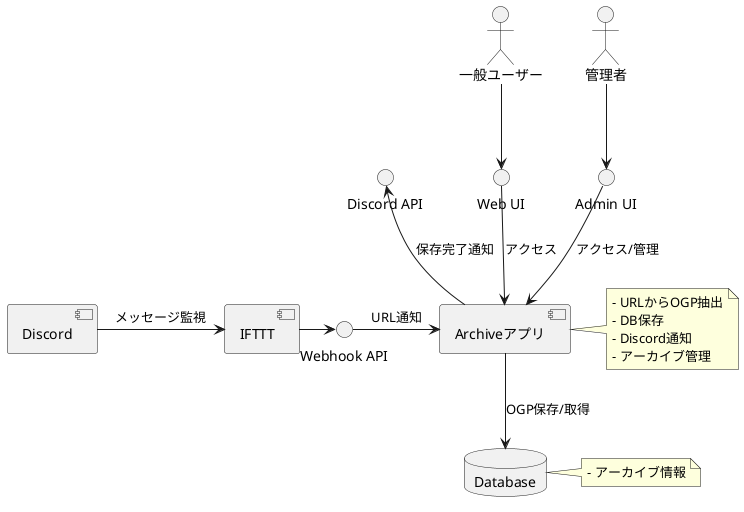
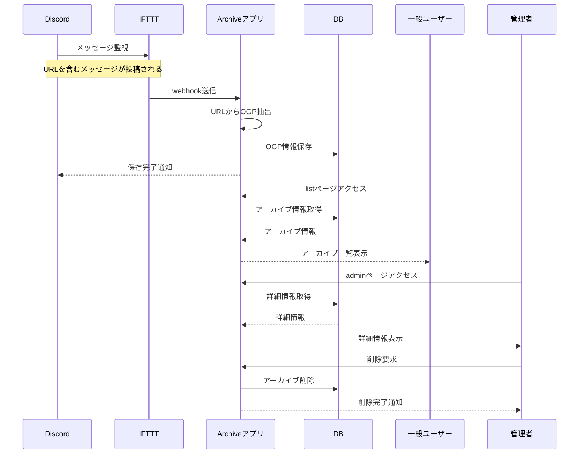

# アーカイブ機能

## 構成

```plantuml
@startuml
' Components
[Discord] as discord
[IFTTT] as ifttt
[Archiveアプリ] as archive
database "Database" as db
actor "一般ユーザー" as user
actor "管理者" as admin

' Interfaces
interface "Webhook API" as webhook
interface "Discord API" as discord_api
interface "Web UI" as web_ui
interface "Admin UI" as admin_ui

' Connections
discord -right-> ifttt : メッセージ監視
ifttt -right-> webhook
webhook -right-> archive : URL通知

archive -up-> discord_api : 保存完了通知
archive -down-> db : OGP保存/取得

user --> web_ui
web_ui --> archive : アクセス
admin --> admin_ui
admin_ui --> archive : アクセス/管理

' Notes
note right of archive
  - URLからOGP抽出
  - DB保存
  - Discord通知
  - アーカイブ管理
end note

note right of db
  - アーカイブ情報
end note
@enduml
```

## シーケンス

```mermaid
sequenceDiagram
    participant Discord
    participant IFTTT
    participant Archive as Archiveアプリ
    participant DB
    participant User as 一般ユーザー
    participant Admin as 管理者

    Discord->>IFTTT: メッセージ監視
    Note over Discord,IFTTT: URLを含むメッセージが投稿される
    IFTTT->>Archive: webhook送信
    Archive->>Archive: URLからOGP抽出
    Archive->>DB: OGP情報保存
    Archive-->>Discord: 保存完了通知

    User->>Archive: listページアクセス
    Archive->>DB: アーカイブ情報取得
    DB-->>Archive: アーカイブ情報
    Archive-->>User: アーカイブ一覧表示

    Admin->>Archive: adminページアクセス
    Archive->>DB: 詳細情報取得
    DB-->>Archive: 詳細情報
    Archive-->>Admin: 詳細情報表示
    Admin->>Archive: 削除要求
    Archive->>DB: アーカイブ削除
    Archive-->>Admin: 削除完了通知

```