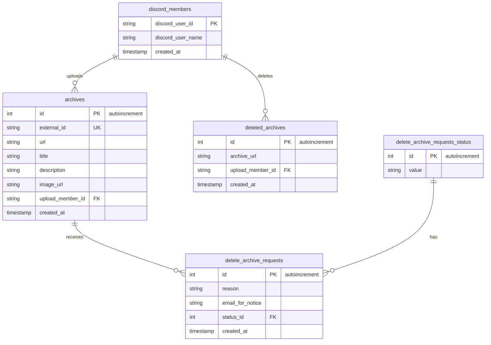

# データ定義

## ER図

```mermaid
erDiagram
    discord_members ||--o{ archives : "uploads"
    discord_members ||--o{ deleted_archives : "deletes"
    archives ||--o{ delete_archive_requests : "receives"
    delete_archive_requests_status ||--o{ delete_archive_requests : "has"

    discord_members {
        string discord_user_id PK
        string discord_user_name
        timestamp created_at
    }

    archives {
        int id PK "autoincrement"
        string external_id UK
        string url
        string title
        string description
        string image_url
        string upload_member_id FK
        timestamp created_at
    }

    delete_archive_requests {
        int id PK "autoincrement"
        string reason
        string email_for_notice
        int status_id FK
        timestamp created_at
    }

    delete_archive_requests_status {
        int id PK "autoincrement"
        string value
    }

    deleted_archives {
        int id PK "autoincrement"
        string archive_url
        string upload_member_id FK
        timestamp created_at
    }
```
