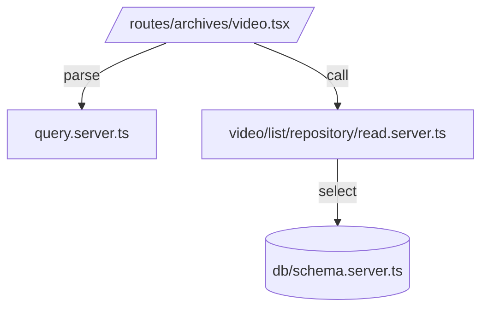

# 設計

- ポイント
  - 既存の共通クエリ `query.server.ts` に `s` を追加（動画専用パラメタだが、影響はデフォルト値で無害化）
  - `v`（表示モード: card/list）を追加し、カード/リスト切替を実装
  - 動画リポジトリで URL のドメインに基づく WHERE 条件を追加（簡易なソース判定）
  - UI はカード型を再レイアウト（アスペクト比固定、バッジ/日付の上部配置）＋リスト型（横並び）を追加

- 依存図（mermaid）

- コンポーネント構成
  - `VideoArchives`（検索フォーム+一覧+ページング）
  - `ArchiveItem`（カード: バッジ/日付/サムネ/タイトル/説明）
