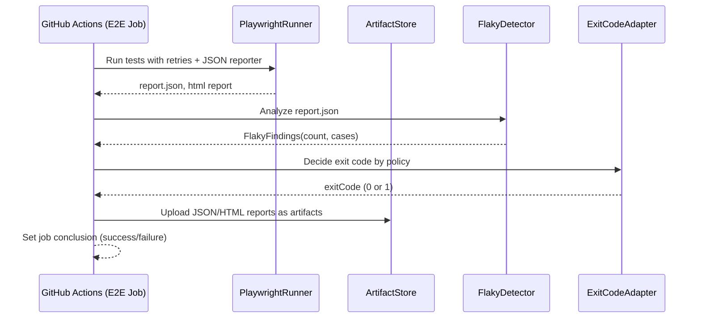

# ドメインモデル（CIにおけるE2Eフレーク検知）

本ドメインは GitHub Actions 上での E2E 実行とレポート解析、フレーク検知、結果反映の流れを対象とする。

## コンポーネント相互関係（クラス図）

```mermaid
classDiagram
    class E2EWorkflow {
      +runPlaywright()
      +collectReports()
      +analyzeFlaky()
      +decideExitCode()
    }

    class PlaywrightRunner {
      +retries: number
      +reporters: string[]
      +run(): Report
    }

    class Report {
      +path: string
      +suites: Suite[]
      +summary: Summary
    }

    class Suite {
      +title: string
      +tests: TestCase[]
    }

    class TestCase {
      +title: string
      +results: Attempt[]
      +status: Status
    }

    class Attempt {
      +status: Status
      +durationMs: number
    }

    class Summary {
      +passed: number
      +failed: number
      +skipped: number
      +flaky: number
    }

    class FlakyDetector {
      +policy: FlakyPolicy
      +detect(report: Report): FlakyFindings
    }

    class FlakyFindings {
      +count: number
      +cases: TestCase[]
    }

    class ExitCodeAdapter {
      +fromFindings(findings: FlakyFindings, policy: FlakyPolicy): number
    }

    class ArtifactStore {
      +upload(reportPaths: string[]): void
    }

    E2EWorkflow --> PlaywrightRunner
    E2EWorkflow --> FlakyDetector
    E2EWorkflow --> ExitCodeAdapter
    E2EWorkflow --> ArtifactStore
    PlaywrightRunner --> Report
    Report --> Suite
    Suite --> TestCase
    TestCase --> Attempt
    Report --> Summary

    enum Status {
      passed
      failed
      skipped
      timedOut
      // some versions may mark flaky explicitly
    }

    enum FlakyPolicy {
      fail
      warn
    }
```

## データフロー（シーケンス図）



