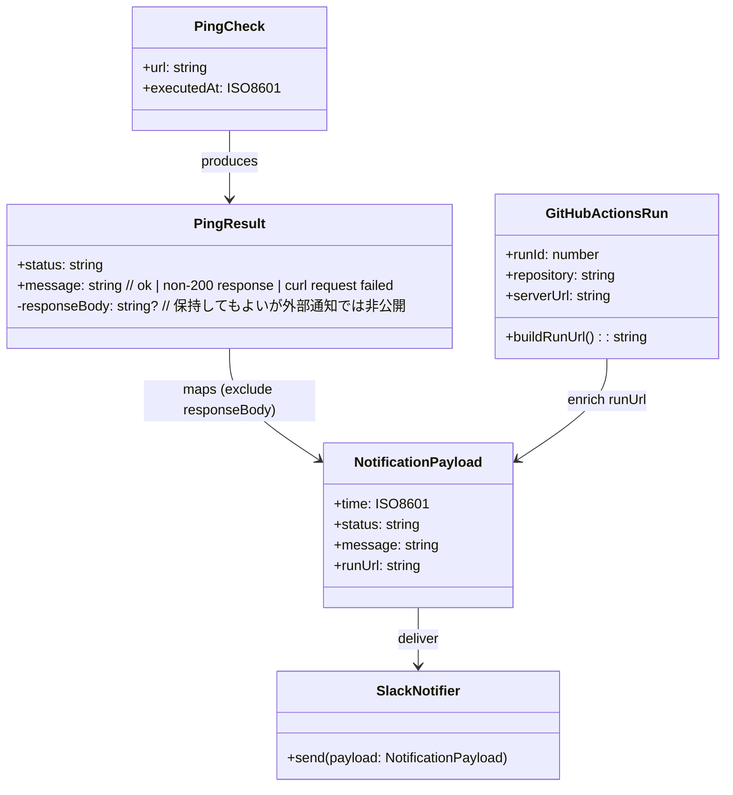

# ドメインモデル（Ping Bot 通知）

```mermaid
classDiagram
  class PingCheck {
    +url: string
    +executedAt: ISO8601
  }

  class PingResult {
    +status: string
    +message: string  // ok | non-200 response | curl request failed
    -responseBody: string?  // 保持してもよいが外部通知では非公開
  }

  class NotificationPayload {
    +time: ISO8601
    +status: string
    +message: string
    +runUrl: string
  }

  class SlackNotifier {
    +send(payload: NotificationPayload)
  }

  class GitHubActionsRun {
    +runId: number
    +repository: string
    +serverUrl: string
    +buildRunUrl(): string
  }

  PingCheck --> PingResult : produces
  PingResult --> NotificationPayload : maps (exclude responseBody)
  GitHubActionsRun --> NotificationPayload : enrich runUrl
  NotificationPayload --> SlackNotifier : deliver
```

- ポリシー: `responseBody` は通知に含めない（内部ログ/アーティファクトでの追跡に留める）。
- トレーサビリティ: `GitHubActionsRun` から生成される `runUrl` を必須で付与。

