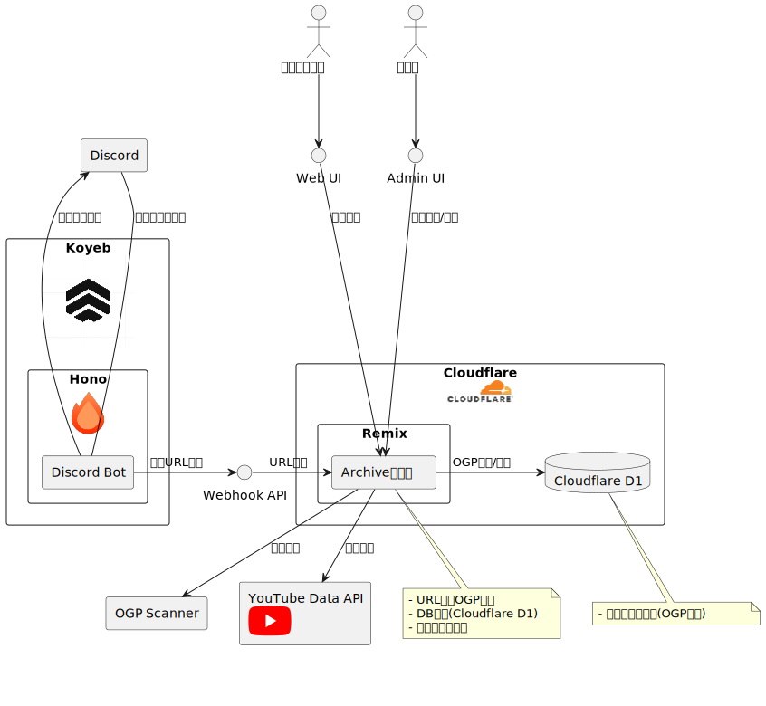
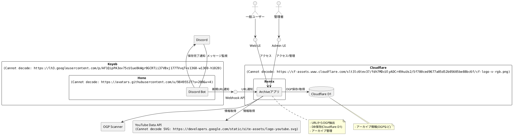
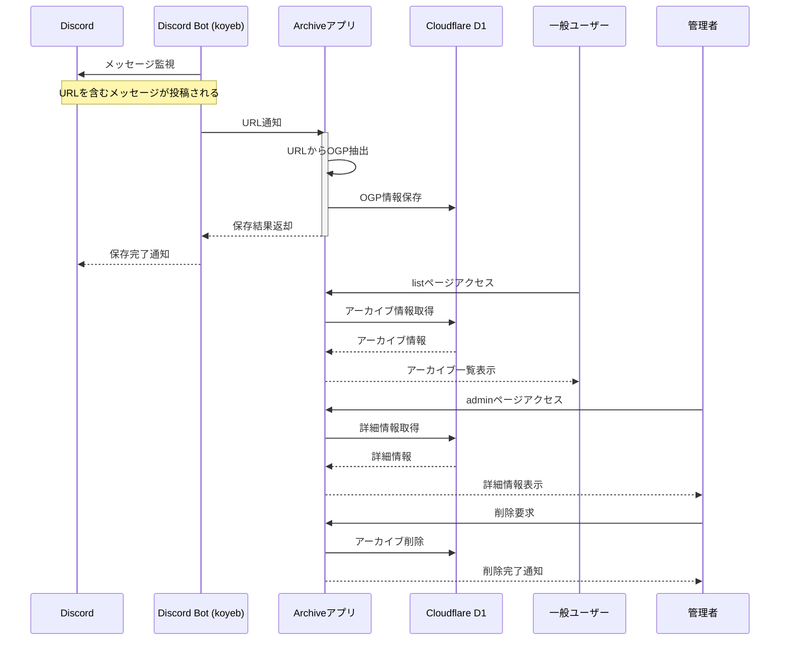

# アーカイブ機能

## 構成

```plantuml
@startuml
'--- スキンパラメータなどの設定例 ---
skinparam defaultFontName "Meiryo"         ' 日本語表示用フォント例
skinparam componentStyle rectangle
skinparam maxMessageSize 80

'--- コンポーネント定義 ---
component "Koyeb\n<img:https://lh3.googleusercontent.com/p/AF1QipPA3ov75cU1ue8kWgr0GCRTii37VBxj177TVvqT=s1360-w1360-h1020{scale=0.1}>" as koyeb {
  component "Hono\n<img:https://avatars.githubusercontent.com/u/98495527?s=200&v=4{scale=0.3}>" as hono {
    [Discord Bot] as discordbot
  }
}

component "Cloudflare\n<img:https://cf-assets.www.cloudflare.com/slt3lc6tev37/fdh7MDcUlyADCr49kuUs2/5f780ced9677a05d52b05605be88bc6f/cf-logo-v-rgb.png{scale=0.1}>" as cloudflare {
  component "Remix" as Remix {
    [Archiveアプリ] as archive
  }
  database "Cloudflare D1" as db
}

component "OGP Scanner" as ogpScanner
component "YouTube Data API\n<img:https://developers.google.com/static/site-assets/logo-youtube.svg{scale=0.3}>" as youtubeAPI

[Discord] as discord

'--- アクター定義 ---
actor "一般ユーザー" as user
actor "管理者" as admin

'--- インターフェース ---
interface "Webhook API" as webhook
interface "Web UI" as web_ui
interface "Admin UI" as admin_ui

'--- 関連 ---
discord -- discordbot : メッセージ監視
discordbot -> webhook : 新規URL通知
webhook -> archive : URL通知

archive --> youtubeAPI : 情報取得
archive --> ogpScanner : 情報取得
archive -> db : OGP保存/取得

discordbot -> discord : 保存完了通知

user --> web_ui
web_ui --> archive : アクセス
admin --> admin_ui
admin_ui --> archive : アクセス/管理

'--- メモ ---
note bottom of archive
  - URLからOGP抽出
  - DB保存(Cloudflare D1)
  - アーカイブ管理
end note

note bottom of db
  - アーカイブ情報(OGPなど)
end note
@enduml
```

## シーケンス

```mermaid
sequenceDiagram
    participant Discord
    participant Bot as Discord Bot (koyeb)
    participant Archive as Archiveアプリ
    participant DB as Cloudflare D1
    participant User as 一般ユーザー
    participant Admin as 管理者

    Bot->>Discord: メッセージ監視
    Note over Discord,Bot: URLを含むメッセージが投稿される
    
    Bot->>Archive: URL通知
    activate Archive
    Archive->>Archive: URLからOGP抽出
    Archive->>DB: OGP情報保存
    Archive-->>Bot: 保存結果返却
    deactivate Archive
    Bot-->>Discord: 保存完了通知

    User->>Archive: listページアクセス
    Archive->>DB: アーカイブ情報取得
    DB-->>Archive: アーカイブ情報
    Archive-->>User: アーカイブ一覧表示

    Admin->>Archive: adminページアクセス
    Archive->>DB: 詳細情報取得
    DB-->>Archive: 詳細情報
    Archive-->>Admin: 詳細情報表示
    Admin->>Archive: 削除要求
    Archive->>DB: アーカイブ削除
    Archive-->>Admin: 削除完了通知
```

## データ

[ER図](../../data/README.md)を参照
