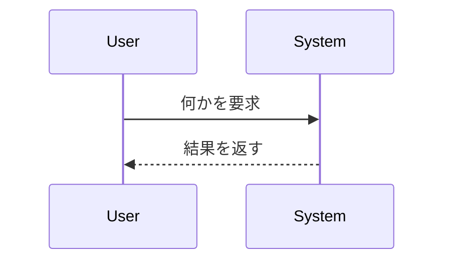

# シナリオテンプレート（タイトルを置換）

## ペルソナ
- 例: 一般ユーザー / 管理者 / 外部システム

## 前提条件
- 必要な前提（ログイン状態、データ存在など）

## トリガー
- シナリオ開始の契機（イベント/操作）

## 基本フロー
1. ・・・
2. ・・・

## 代替フロー / 例外
- ・・・

## シーケンス図（任意）

```mermaid
sequenceDiagram
  participant U as User
  participant S as System
  U->>S: 何かを要求
  S-->>U: 結果を返す
```
