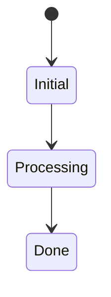
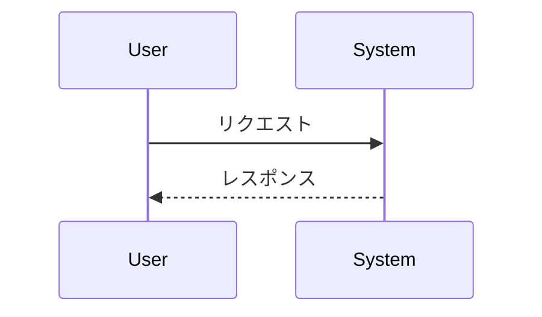

# 仕様テンプレート（タイトルを置換）

## 概要
- 対象機能/文脈/目的の要約。

## 用語集（任意）
- 主要な用語の定義。

## 機能仕様
- 振る舞い、前提、制約、ビジネスルール。
- UI/UX 方針（必要ならワイヤーフレームリンク）。

## API 仕様（任意）
- エンドポイント、メソッド、パラメータ、レスポンス、エラーパターン。

## 状態遷移（任意）

## エラー/例外
- 代表例とハンドリング方針。

## 非機能要件
- セキュリティ / パフォーマンス / アクセシビリティ / 観測性・トレーサビリティ。

## 受け入れ基準
- シナリオ別の具体的なテスト観点。

## 参考図（任意）

