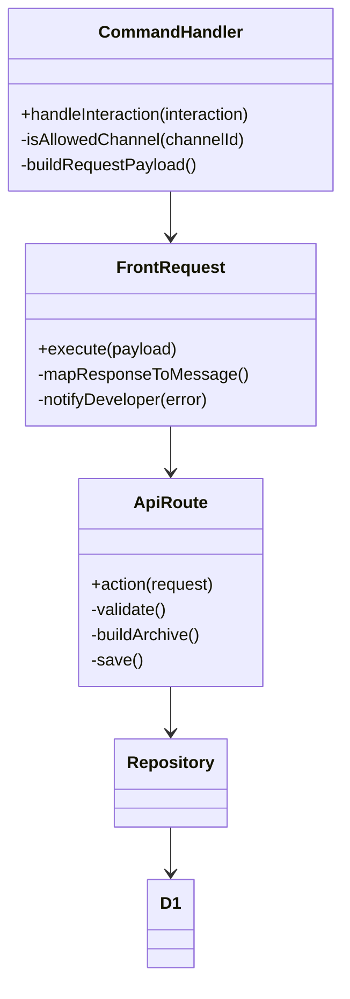

# チャレンジ/動画アーカイブ Discord コマンド登録: 設計

## 対象ドキュメント

- 要求: `docs/spec/archive/requests.md`
- シナリオ: `docs/spec/archive/scenario.md`
- 要件: `docs/spec/archive/requirements.md`
- 仕様: `docs/spec/archive/spec.md`

## 全体構成

- Discord Bot (`packages/discord-bot`)
  - Slash コマンドハンドラ（`/archive-challenge`, `/archive-video`）
  - 共通 API クライアント（`createArchiveCommand` ファクトリ）
  - 構造化ログ出力
  - 開発者通知
- アプリケーション API (`packages/front`)
  - `/api/archives/challenge`・`/api/archives/video` ルート
  - URL 正規化・重複チェック・OGP 取得・保存処理
  - 構造化ログ

## ユースケース対応表

| ユースケース | 設計参照 | 備考 |
| --- | --- | --- |
| UC1 チャレンジアーカイブを登録する | Discord Bot 詳細 / API 詳細 / コンポーネント | `/archive-challenge` の入力から保存まで |
| UC2 動画アーカイブを登録する | Discord Bot 詳細 / API 詳細 / コンポーネント | `/archive-video` の入力から保存まで |
| UC3 500エラー時の開発者通知 | Discord Bot 詳細 > 開発者通知 / ログ | 500エラー検知と通知フロー |
| UC4 許可チャンネル設定を運用する | Discord Bot 詳細 > コマンドハンドラ / 環境変数一覧 | チャンネルID管理 |

## コンポーネント

```mermaid
flowchart LR
  subgraph Discord
    User[一般参加者]
    Bot[Discord Bot]
  end
  subgraph App
    APIChallenge[API Route /archives/challenge]
    APIVideo[API Route /archives/video]
    Service[Upload Functions]
    Repo[Repository (D1)]
  end
  subgraph Infra
    D1[(Cloudflare D1)]
  end
  subgraph Ops
    DevChan[開発者用Discordチャンネル]
    Logs[構造化ログ基盤]
  end

  User --> Bot
  Bot --> APIChallenge
  Bot --> APIVideo
  APIChallenge --> Service
  APIVideo --> Service
  Service --> Repo
  Repo --> D1
  Service --> Logs
  Bot --> Logs
  Bot --> DevChan
```

## Discord Bot 詳細

### コマンドハンドラ

- ファイル: `packages/discord-bot/src/bot/commands/archive-challenge.ts`, `packages/discord-bot/src/bot/commands/archive-video.ts`
- 役割: Interaction から入力値を取得し、許可チャンネル判定後に `createArchiveCommand` が提供する共通処理へ引き渡す
- 拡張: 許可チャンネル ID リストを環境変数からロードし、Set 化して高速判定する

### API クライアント

- 共通ファクトリ `createArchiveCommand` が Fetch 呼び出し・開発者通知・レスポンスメッセージ生成を一元化
- 応答の `errorCode` を取り出し、メッセージマッピングに利用（欠落時は `unknown` を利用）
- 500 エラー時は開発者通知 (`sendDeveloperAlert`) を実行し、投稿内容に入力パラメータを含める

### ログ

- Bot 側は `log()` を通じて構造化 JSON を出力し、`correlationId`, `discordUserId`, `channelId`, `command` を共通フィールドとする
- 許可外チャンネル・Fetch 失敗時は `level: "info"` / `level: "error"` を切り分ける
- API 500 応答時は `errorCode` と入力パラメータを含めて `level: "error"` で記録し、通知内容と突合できるようにする

### 開発者通知

- 役割: 500 エラー時に `DISCORD_DEV_ALERT_CHANNEL_ID` へメッセージ投稿
- 実装: Discord Bot のクライアント経由で `sendMessage`。テキスト例: `予期しないエラー (コード: failed-get-ogp, correlationId: ... , user: ...)`
- 送信失敗時は最大3回までリトライし、それでも失敗した場合は構造化エラーログに記録してフォールバックする
- アラート強化案（検討中）: 通知失敗や高頻度の500検知を検出したい場合は、Slack WebhookやOpsgenieなど既存のアラート基盤へ同内容をブロードキャストするハンドラを追加する

## アプリケーション API 詳細

### ミドルウェア

- `requireAuthToken` で Bearer 認証
- `X-Correlation-ID` ヘッダーを受け取りログに含める（存在しない場合は新規生成を検討）

### 業務ロジック

1. リクエストを Zod で検証（チャレンジ: `postChallengeArchiveBody`、動画: `postArchiveBody`）
2. URL 重複チェック（チャレンジ: `findChallengeArchiveByURL`、動画: `findVideoArchiveByURL`）
3. サポート外 URL 判定と OGP 取得 (`getOgpStrategyProvider`)
4. description/title 未指定分を OGP 情報で補完し、失敗時は `failed-get-ogp` を throw (500)
5. 保存処理（チャレンジ: `saveChallengeArchive`、動画: `saveVideoArchive`）
6. 成功時は 200

### ログ設計

- ロガー（Cloudflare Workers の `console.log` ラッパ）を利用し構造化 JSON を出力
- 共通フィールド: `correlationId`, `discordUserId`, `url`, `command`
- 成功時: `{ level: 'info', message: 'archive-created', correlationId, command, result: 'created' }` など既存命名に合わせる
- 重複・サポート外: `{ level: 'info', message: 'archive-skipped', code, correlationId, urlNormalized }`
- 500 エラー: `{ level: 'error', message: 'archive-error', correlationId, errorCode, detail }`

## プライベート関数・ユーティリティ

- `createArchiveCommand(...)` : Slash コマンドビルダーと設定を受け取り共通実装を生成
- `parseAllowedChannelIds(envVar: string)` : string -&gt; Set&lt;string&gt;
- `sendDeveloperAlert(interaction, content, metadata)` : 開発者チャンネルへ通知を送る
- `frontApi(path: string)` : Fetch 用の API URL を構築
- `makeCatchesSerializable(error)` : 例外情報をログに出力できる形へ整形

## 環境変数一覧

| 変数名 | 用途 |
| --- | --- |
| `DISCORD_ALLOWED_CHALLENGE_ARCHIVE_CHANNEL_IDS` | チャレンジアーカイブ許可チャンネル ID |
| `DISCORD_ALLOWED_VIDEO_ARCHIVE_CHANNEL_IDS` | 動画アーカイブ許可チャンネル ID |
| `DISCORD_DEV_ALERT_CHANNEL_ID` | 500 エラー通知先チャンネル |
| `FRONT_URL` | API 呼び出し先 |
| `FRONT_AUTH_UPLOAD_ARCHIVE` | API Bearer Token |
| `LOG_LEVEL` | Bot ログレベル |

> 運用メモ: 本番デプロイ前に `DISCORD_ALLOWED_CHALLENGE_ARCHIVE_CHANNEL_IDS`・`DISCORD_ALLOWED_VIDEO_ARCHIVE_CHANNEL_IDS`・`DISCORD_DEV_ALERT_CHANNEL_ID` を Secrets/環境変数に設定し、Slash コマンドを `pnpm --filter @ac-extreme-mercenaries/discord-bot run deploy:commands` で再登録する。

## エラーハンドリング設計

- API から 400 (`unsupported-url`, `duplicated-url`): Bot 側は info レベルでログし、ユーザー向けメッセージ返却
- API 500 (`failed-get-ogp`, `unknownError`): Bot 側で error ログ、開発者通知、ユーザーには共通メッセージ
- Fetch 失敗: Bot 側で error ログ (`FetchError`)、ユーザーに `アーカイブ追加に失敗しました`
- パースエラー（Discord Interaction 解析失敗）: `log('error', {...})` + 内部通知検討 (現状はログのみ)

## テーブル・データ影響

- D1 スキーマ変更はなし。既存 `challenge_archives`・`video_archives`・`discord_members` を利用
- `updateChallengeArchiveListRevision` / `updateVideoArchiveListRevision` により一覧キャッシュを更新

## 実装計画

| タスク | 内容 | 担当 | 備考 |
| --- | --- | --- | --- |
| T1 | Slashコマンド定義を更新し `deploy-commands` で登録する | Bot担当 | `/archive-challenge` と `/archive-video` の入力パラメータ設定 |
| T2 | コマンドハンドラ実装と許可チャンネル判定ロジックを追加 | Bot担当 | `DISCORD_ALLOWED_*_ARCHIVE_CHANNEL_IDS` を Set 化 |
| T3 | エラーメッセージ/ログ/開発者通知処理を実装 | Bot担当 | `client.channels.fetch` を用いた通知 |
| T4 | `frontRequestHandler` 拡張 (X-Correlation-ID ヘッダー、errorCode 伝搬) | Bot担当 | 既存呼び出し箇所への影響調査 |
| T5 | API で `X-Correlation-ID` 受領・ログ出力を追加、500/400 応答を整理 | Front担当 | チャレンジ/動画両 API で `console.log` ラッパを利用 |
| T6 | 重複/OGP 処理のログ詳細 (正規化 URL 等) を追加 | Front担当 | `findChallengeArchiveByURL` / `findVideoArchiveByURL` の戻り値利用 |
| T7 | ユニットテスト/統合テスト/e2e の整備 | Bot担当 + Front担当 | 下記テストケース詳細を参照 |
| T8 | 環境変数設定とドキュメント更新 (.env, README) | 運用担当 | チャレンジ/動画許可チャンネルIDと開発者チャンネルID |

## テストケース詳細

| ID | シナリオ | 前提 | 手順 | 期待結果 |
| --- | --- | --- | --- | --- |
| TC1 | description あり正常登録 | 許可チャンネル / API 正常 | `/archive-challenge` に title/url/description 入力 | メッセージ「アーカイブに登録しました」、D1 に保存、ログ出力 |
| TC2 | description なし + OGP 成功 | OGP 取得可能な URL | description 未入力で送信 | OGP description が保存されメッセージ成功 |
| TC3 | description なし + OGP 失敗 | API 単体テストで OGP 取得モジュールをモック | 送信 | 「予期しないエラー (コード: failed-get-ogp)」、開発者通知送信、500 応答ログ |
| TC4 | URL 重複 | 既存 URL 登録済み | 同一URLで送信 | 「登録済みのアーカイブなので、スキップしました」、ログに raw/normalized/existing URL |
| TC5 | サポート外 URL | サポートパターン外 URL | 送信 | 「サポート外のURLなのでスキップしました」、400 応答 |
| TC6 | 許可外チャンネル | 許可リストに含まれないチャンネル | 同コマンド送信 | 警告メッセージ、API 未呼び出し、info ログ |
| TC7 | API ネットワーク障害 | API 呼び出し失敗をモック | 送信 | 「アーカイブ追加に失敗しました」、error ログ |
| TC8 | 複数チャンネル設定 | 環境変数に複数 ID 設定 | 各チャンネルでコマンド試行 | 許可チャンネルで成功、非許可で警告 |
| TC9 | 500 エラー `unknownError` | API が unknownError を返す | 送信 | 「予期しないエラー (コード: unknownError)」、開発者通知 |
| TC10 | 動画アーカイブ正常登録 | 動画許可チャンネル / API 正常 | `/archive-video` に url/title/description 入力 | メッセージ「アーカイブに登録しました」、D1 に保存、ログ出力 |
| TC11 | 動画アーカイブ OGP 取得失敗 | `failed-get-ogp` を返すモック | `/archive-video` で title/description 未入力 | 「アーカイブの情報を取得できませんでした」、error ログ、開発者通知 |
| TC12 | 動画アーカイブ URL 重複 | 既存動画 URL 登録済み | 同一URLで送信 | 「既にアーカイブ済みのURLなのでスキップしました」、info ログ |

- Bot 単体テスト: 許可チャンネル判定、エラーメッセージマッピング、開発者通知呼び出し
- API 単体テスト: 重複判定・OGP 取得モック（APIモジュールで実施）・エラーコード返却
- 統合テスト: Bot -> API -> D1 の流れ（e2e テスト環境で）
- 通知テスト: テスト用 `DISCORD_DEV_ALERT_CHANNEL_ID` を設定し、メッセージフォーマット確認

## リスク・懸念

- 500 エラー多発時の通知スパム: 将来的に rate limit や集約機能検討
- OGP 取得時間が長い場合の Discord タイムアウト: 必要なら非同期登録や遅延応答検討
- 許可チャンネルリストの運用（チャンネル増減時の環境変数更新）

## Mermaid 図


