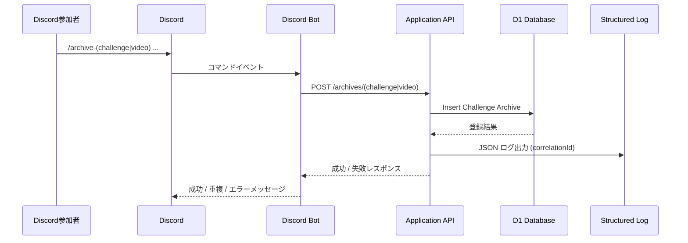

# チャレンジ/動画アーカイブ Discord コマンド登録: 要求

## 5W1H

- Who: Discord コミュニティ一般参加者、Bot 運用者、アプリケーション運用者
- What: Discord Bot コマンド `/archive-challenge` と `/archive-video` を通じてチャレンジ/動画アーカイブを登録できるようにする
- Why: 現状は背景の書式を手入力する必要があり、初学者にはミスが起きやすく心理的ハードルも高い
- Where: コミュニティ用 Discord サーバーのチャレンジ/動画アーカイブ共有チャンネル
- When: Issue #764 の解決に向けて早期（次リリーススプリント）での提供を想定
- How: Discord コマンド → Bot → アプリケーション API → D1 への登録。構造化ログと Discord 通知で結果を可視化

## 背景 / 文脈

- 現状は下記テンプレートを厳守したテキスト投稿でのみ登録可能だが、初参加者には理解が難しく入力ミスも発生しがち。

  ````text
  ```
  {タイトル}

  {URL}
  ```
  ````

- Bot コマンドによる入力補助を用意し、誰でも迷わず登録できる体験にしたい。
- Issue: <https://github.com/tooppoo/armoredcore-extreme-mercenaries/issues/764>
- 既存 ADR (`docs/adr/20250125-archives-table-design.md`) で動画/チャレンジアーカイブを別テーブル管理する方針を採用済み。

## 目的 / ゴール

- Discord 参加者がガイド付きのコマンドでチャレンジ/動画アーカイブを即時登録できるようにし、共有スピードとデータ品質を高める。

## 利害関係者

- Discord 一般参加者（情報投稿者）
- コミュニティ運営者（モデレーション・監査）
- アプリケーション運用者（API・D1・Bot保守）
- サイト閲覧者（登録されたアーカイブを利用）

## スコープ

- 含む:
  - `/archive-challenge` コマンドの入力補助（title/url 必須、description 任意）
  - `/archive-video` コマンドの入力補助（url 必須、title/description 任意）
  - Bot→API→D1 の登録処理と構造化ログ出力
  - 成功・失敗・重複時の Discord メッセージ
- 含まない:
  - 既存アーカイブの更新/削除
  - 多言語対応（日本語のみ運用）
  - コマンド以外の入力手段の刷新

## 制約 / 前提

- 実行主体は Discord 一般参加者（ロール制限なし）
- Bot はアプリケーション API をコールし、API が D1 に登録する
- description 未入力時は OGP description を自動取得（取得不可時のフォールバックは仕様で定義）
- 動画アーカイブでは title/description 未入力時も OGP 情報で補完し、取得不可時は `failed-get-ogp` として扱う
- 重複チェックは URL のみ対象
- 400 番台はエラー文言を Discord へ返却、500 番台は「予期しないエラーが発生しました」を返す
- すべてのログは JSON 構造化形式で出力し、Correlation ID を保持

## 成功基準（受入基準）

- 参加者が `/archive-challenge` のガイドに従って title/url を入力すると、アーカイブが D1 に登録され Discord で「アーカイブに登録しました」と表示される
- 参加者が `/archive-video` のガイドに従って url（任意で title/description）を入力すると、アーカイブが D1 に登録され Discord で「アーカイブに登録しました」と表示される
- URL 重複時、Bot が「登録済みのアーカイブなので、スキップしました」または「既にアーカイブ済みのURLなのでスキップしました」と返し、DB への登録を行わない
- description 未入力でも OGP 取得を通じた説明文が設定され、取得失敗時のフォールバックが仕様とテストで確認済み
- API は成功/失敗問わず構造化ログを出力し、Correlation ID から操作履歴を追跡できる
- 400 番台/500 番台などエラーコードに応じたメッセージ分岐がユニット/E2E テストでカバーされている

## 参考図


