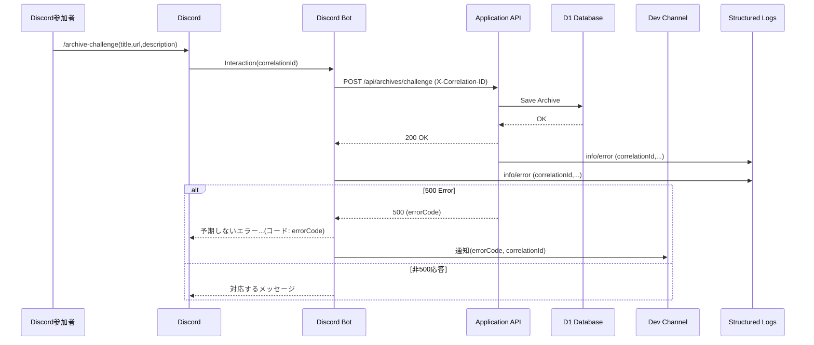

# チャレンジアーカイブ Discord コマンド登録: 仕様

## 対象ドキュメント

- 要求: `docs/requests/challenge-archive-discord-command.md`
- シナリオ: `docs/scenario/challenge-archive-discord-command.md`
- 要件: `docs/requirements/challenge-archive-discord-command.md`

## 概要

Discord スラッシュコマンド `/archive-challenge` を用いて参加者がチャレンジアーカイブを登録する。Bot がアプリケーション API (`POST /api/archives/challenge`) を呼び出し、結果に応じたメッセージをチャンネルへ公開投稿する。構造化ログと開発者向け通知でトレーサビリティと運用性を確保する。

## コマンド仕様

### Slash Command `/archive-challenge`

- 利用者: Discord 一般参加者
- 入力パラメータ（Discord のコマンドビルダーで設定）
  1. `title` (string, 必須)
  2. `url` (string, 必須)
  3. `description` (string, 任意)
- 利用チャンネル制約
  - 環境変数 `DISCORD_ALLOWED_CHALLENGE_ARCHIVE_CHANNEL_IDS`（カンマ区切り）で指定されたチャンネル ID のみで受け付ける
  - その他のチャンネルでは「このコマンドは #チャレンジアーカイブ チャンネルでのみ利用できます」を返し、処理を打ち切る
- 応答メッセージ（公開投稿）
  - 成功: `アーカイブに登録しました`
  - 重複 (`duplicated-url`): `登録済みのアーカイブなので、スキップしました`
  - サポート外 (`unsupported-url`): `サポート外のURLなのでスキップしました`
  - ネットワーク/Fetch失敗: `アーカイブ追加に失敗しました`
  - 500 エラー (`failed-get-ogp`, `unknownError`, 追加予定コード含む): `予期しないエラーが発生しました (コード: {errorCode})`（`errorCode` が欠落した場合は `unknown` を表示）

### 開発者通知

- 500 エラー発生時、`DISCORD_DEV_ALERT_CHANNEL_ID` で指定された開発者専用チャンネルへ通知を送信
- 通知メッセージ例: `チャレンジアーカイブ登録でエラー (コード: failed-get-ogp, correlationId: 123...)`
- 通知内容: `correlationId`, `errorCode`, Discord ユーザー、入力 URL など運用に必要な最小限情報
- 実装方式: `discord.js` の Bot クライアントから `client.channels.fetch(DISCORD_DEV_ALERT_CHANNEL_ID)` でテキストチャンネルを取得し `channel.send(...)` を実行
- 送信に失敗した場合は最大3回までリトライし、それでも失敗した場合はエラーログへフォールバックする

## Bot 実装仕様

### 処理フロー

1. Discord から Interaction を受信し `interaction.id` を `correlationId` として採用
2. コマンド入力値とユーザー情報を抽出
3. 許可チャンネル判定（`DISCORD_ALLOWED_CHALLENGE_ARCHIVE_CHANNEL_IDS`）
4. 上記をパラメータとして API へ POST
5. API 応答ステータスと `errorCode` に応じてメッセージを決定
6. エラー時は必要に応じ開発者チャンネルへ通知

### API 呼び出し

- URL: `${FRONT_URL}/api/archives/challenge`
- メソッド: POST
- ヘッダー
  - `Content-Type: application/json`
  - `Authorization: Bearer ${FRONT_AUTH_UPLOAD_ARCHIVE}`
  - `X-Correlation-ID: ${interaction.id}`
- ボディ

  ```json
  // type=link の場合
  {
    "type": "link",
    "title": "...",
    "url": "...",
    "description": "...",  // オプショナル（未指定の場合は自動取得）
    "discord_user": {
      "id": "...",
      "name": "..."
    }
  }

  // type=text の場合
  {
    "type": "text",
    "title": "...",
    "text": "...",       // テキスト本文
    "discord_user": {
      "id": "...",
      "name": "..."
    }
  }
  ```

- タイムアウト/リトライ: 既存の `frontRequestHandler` 実装に準拠（デフォルトタイムアウト、失敗時の再試行なし）

### 構造化ログ出力

- Bot 側 (`packages/discord-bot/src/lib/log.ts` 利用)
  - 成功時ログ例: `{ level: "info", message: "archive-command-success", correlationId, discordUserId, title, url }`
  - 重複エラー: `{ level: "info", message: "archive-command-duplicated", correlationId, discordUserId, inputUrlRaw, inputUrlNormalized, existingUrl }`
  - 500 エラー: `{ level: "error", message: "archive-command-error", correlationId, discordUserId, errorCode, detail }`
- API 側
  - 論理エラー (`duplicated-url` 等) 発生時に `console.error` ではなく構造化ロガー（既存実装に合わせる）で `correlationId`・`errorCode` を含めて記録

## API 仕様（再掲）

- `POST /api/archives/challenge`
  - 認証: Bearer Token (`FRONT_AUTH_UPLOAD_ARCHIVE`)
  - 入力バリデーション: 既存 Zod スキーマ (`postChallengeArchiveBody`) を継続使用
  - 処理概要
    1. URL 重複チェック (`findChallengeArchiveByURL`)
    2. サポート外 URL 判定 (`getOgpStrategyProvider`)
    3. OGP 取得成功時のみ description を設定（失敗で 500）
    4. `saveChallengeArchive` で D1 保存（正規化 URL）
    5. `updateChallengeArchiveListRevision` 呼出
  - 応答
    - 成功: 200 OK / ボディは `null`
    - 400: `unsupported-url`, `duplicated-url` など
    - 500: `failed-get-ogp`, `unknownError`, その他追加コード

## 通知チャンネル設定

- 環境変数
  - `DISCORD_ALLOWED_CHALLENGE_ARCHIVE_CHANNEL_IDS`: カンマ区切りのチャンネル ID 群
  - `DISCORD_DEV_ALERT_CHANNEL_ID`: 500 エラー通知先チャンネル ID
  - `FRONT_URL`, `FRONT_AUTH_UPLOAD_ARCHIVE`: API 呼び出し用
- 追加想定
  - 通知を無効化するフラグ（例: `DISCORD_NOTIFY_ERRORS=false`）を将来導入する余地を残す

## セキュリティ

- 実行チャンネル判定・認証トークンは環境変数で管理しリポジトリに含めない
- ログにはトークンや個人情報を含めない（Discord ユーザー名は API 保存済みのためログには ID のみ原則とする。表示が必要な場合でもマスクを検討）

## テスト計画（仕様準拠）

- Bot ユニットテスト: メッセージマッピング、チャンネル判定、開発者通知の条件分岐
- API 統合テスト: 400/500 応答時の `errorCode` 出力とログ内容
- e2e テスト（Playwright 等）: Discord モックまたは Bot スタブでの基本フロー確認
- 通知テスト: テスト用チャンネル ID を使い、通知フォーマットが期待通りか

## Mermaid 図


