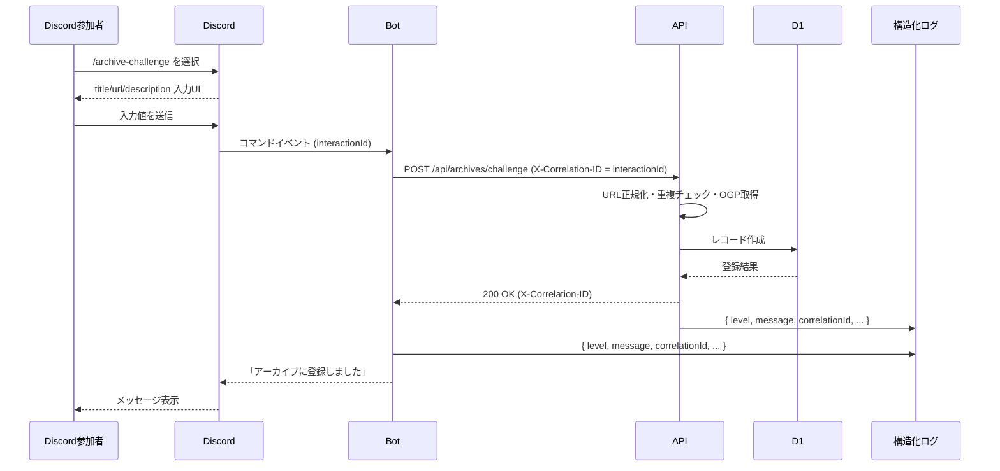

# チャレンジアーカイブ Discord コマンド登録: シナリオ

## ペルソナ

- Discord 一般参加者: 攻略情報を共有したいコミュニティメンバー
- Discord Bot: `/archive-challenge` コマンドを受け付け、バックエンド API と連携するエージェント
- アプリケーション API: チャレンジアーカイブを D1 に登録するバックエンド

## 前提条件

- 参加者は Discord サーバーに参加済みで、チャレンジアーカイブ投稿専用チャンネルへアクセスできる
- `/archive-challenge` コマンドは指定チャンネルのみ利用可能に設定されている
- Bot がオンラインで、`FRONT_URL` や認可トークンなど必要な環境変数が正しく設定されている
- アプリケーション API は稼働中で、URL 正規化・重複判定・OGP 取得・エラーコード出力（`unsupported-url` / `duplicated-url` / `failed-get-ogp` / `unknownError`）を提供している
- Bot は各コマンド実行ごとに Discord Interaction ID を相関 ID として採用し、ヘッダー `X-Correlation-ID` 等で API に渡し、双方の構造化ログへ記録できる
- コマンド応答メッセージは公開投稿としてチャンネルに表示される

## トリガー

- 参加者がチャレンジアーカイブ共有チャンネルで `/archive-challenge` コマンドを実行する

## 基本フロー（description を明示入力する場合）

1. 参加者が `/archive-challenge` を選択すると、Discord が `title`（必須）入力 UI を表示する
2. `title` を入力すると、Discord が `url`（必須）入力 UI を表示する
3. `url` を入力すると、Discord が `description`（任意）入力 UI を表示する
4. 参加者が description を入力し、コマンドを送信する
5. Bot は Discord Interaction ID を相関 ID として設定し、入力値と Discord ユーザー情報・相関 ID を API に POST する
6. API は URL を正規化し、重複が無いか確認した上で D1 にレコードを作成する
7. 登録成功時、API は 200 を返し、Bot は「アーカイブに登録しました」とチャンネルに投稿する
8. Bot と API は相関 ID を含めた構造化ログ（JSON）を出力し、後追い可能にする

## 代替フロー / 例外

- **AF-1: description を空のまま送信し、OGP 取得が成功した場合**
  - ステップ4で description を未入力のまま送信する
  - API は URL の OGP 情報から description を取得し、登録する
  - 以降は基本フロー 6〜8 と同様に進む

- **AF-2: description 未入力で OGP 取得に失敗した場合**
  - API は `failed-get-ogp` コードを含む 500 を返す
  - Bot はチャンネルに「予期しないエラーが発生しました (コード: failed-get-ogp)」と投稿し、相関 ID をログに出力する（利用者向けメッセージの基本文言は共通）

- **AF-3: URL が既存レコードと重複していた場合**
  - API は `duplicated-url` コードを含む 400 を返す
  - Bot はチャンネルに「登録済みのアーカイブなので、スキップしました」と投稿する（既存メッセージマッピングを利用）

- **AF-4: サポート外の URL だった場合**
  - API は `unsupported-url` コードを含む 400 を返す
  - Bot はチャンネルに「サポート外のURLなのでスキップしました」と投稿する

- **AF-5: 許可されていないチャンネルで実行された場合**
  - Bot は処理を行わず、「このコマンドは #チャレンジアーカイブ チャンネルでのみ利用できます」と警告投稿し、警告ログを出力する（メンションなし）

- **AF-6: API 呼び出し自体が失敗した場合（ネットワーク障害等）**
  - Bot は「アーカイブ追加に失敗しました」と投稿し、相関 ID とともにエラー詳細を構造化ログへ出力する

- **AF-7: OGP 以外の要因で 500 エラーが返った場合**
  - API は `unknownError` などのコードを添えて 500 を返す
  - Bot は「予期しないエラーが発生しました (コード: unknownError)」と投稿し、ログで詳細を追跡する

## シーケンス図（基本フロー）

## 相関 ID の用途と例

- 用途: Bot と API のログを突き合わせ、特定の Discord コマンド実行に紐づく処理状況を追跡するため。障害分析・監査時に「どの参加者がいつどの URL を登録しようとしたか」を一貫して確認できる。
- 例: Discord Interaction から提供される `interaction.id`（例: `1234567890123456789`）を `X-Correlation-ID` ヘッダーで API に渡し、Bot と API の構造化ログに { "correlationId": "1234567890123456789" } として記録する。
- 懸念点: Interaction ID は Discord 側でユニーク性が保証されているが、将来的に API 側で別形式の ID が必要になった場合に備えて、Bot 側で UUID など生成する拡張余地は残しておくと柔軟。

## 確認済み事項

- 許可外チャンネル警告メッセージは固定文言「このコマンドは #チャレンジアーカイブ チャンネルでのみ利用できます」で運用する
- 500 エラー時の Discord 投稿は「予期しないエラーが発生しました (コード: {errorCode})」で統一し、API 側のコード値と連動させる
