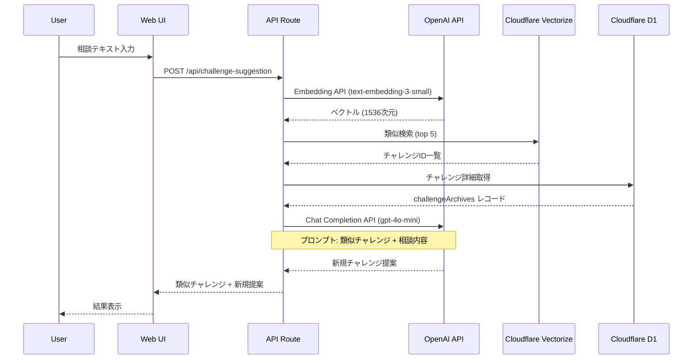

# チャレンジ提案AI - 技術設計

## システム構成



## インフラ構成

### 新規リソース

| リソース | 名前 | 用途 |
| ---------- | ------ | ------ |
| Vectorize Index | `ac-exm-challenge-embeddings` | チャレンジのベクトルインデックス |
| Secret | `OPENAI_API_KEY` | OpenAI API認証 |

### Vectorize インデックス設定

```bash
wrangler vectorize create ac-exm-challenge-embeddings \
  --dimensions=1536 \
  --metric=cosine
```

- **dimensions**: 1536 (text-embedding-3-small の出力次元)
- **metric**: cosine (テキスト類似度に適切)

## データモデル

### Vectorize メタデータ

```typescript
interface ChallengeEmbeddingMetadata {
  challengeId: number      // challengeArchives.id
  externalId: string       // challengeArchives.externalId
  title: string            // 検索結果表示用
}
```

## API設計

### POST /api/challenge-suggestion

#### リクエスト

```typescript
interface ChallengeSuggestionRequest {
  consultation: string  // 相談内容 (最大1000文字)
}
```

#### レスポンス

```typescript
interface ChallengeSuggestionResponse {
  similarChallenges: Array<{
    externalId: string
    title: string
    description: string
    url: string | null
    similarity: number  // 0-1
  }>
  suggestion: {
    title: string
    description: string
    hashtag: string
  }
}
```

#### エラーレスポンス

```typescript
interface ErrorResponse {
  error: {
    code: 'INVALID_INPUT' | 'SERVICE_UNAVAILABLE'
    message: string
  }
}
```

## ディレクトリ構成

```txt
packages/front/app/lib/challenge-suggestion/
├── embedding/
│   ├── client.server.ts            # OpenAI Embedding クライアント
│   └── similarity.server.ts        # 類似チャレンジ検索
├── generation/
│   └── generator.server.ts         # チャレンジ生成
└── types.ts                        # 型定義
```

## プロンプト設計

### システムプロンプト

```txt
あなたはアーマードコア6のチャレンジ（縛りプレイ）を提案するAIです。
ユーザーの相談内容と、過去の人気チャレンジを参考に、新しいチャレンジを提案してください。

チャレンジは以下の形式で提案してください：
- タイトル: キャッチーで覚えやすい名前（例：「ヘリアンサスチャレンジ」）
- 詳細条件: 対象ミッション、使用機体・パーツの制約、クリア条件など
- ハッシュタグ: SNS共有用のハッシュタグ（例：#ヘリアンサスチャレンジ）

チャレンジの難易度はユーザーの相談内容に合わせて調整してください。
```

## コスト見積もり

### OpenAI API

| モデル | 用途 | 単価 (per 1M tokens) |
| ------ | ---- | ------------------- |
| text-embedding-3-small | Embedding | $0.02 |
| gpt-4o-mini | チャレンジ生成 | $0.15 (input) / $0.60 (output) |

### 1リクエストあたりの想定コスト

- Embedding: ~200 tokens → $0.000004
- Chat (input): ~2000 tokens → $0.0003
- Chat (output): ~500 tokens → $0.0003
- **合計: 約 $0.0006/リクエスト**

## セキュリティ考慮

- `OPENAI_API_KEY` は Cloudflare Secrets で管理
- ログ出力時に API キーを含めない
- 入力テキストのサニタイズ（最大文字数制限）
