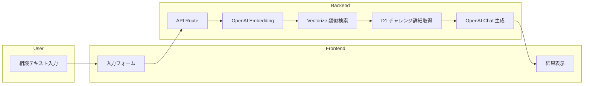

# チャレンジ提案AI

## 背景 / 文脈

- アーマードコアシリーズのプレイヤーは、ゲームをより深く楽しむために様々な縛りプレイ（チャレンジ）を行っている
- 既存のチャレンジアーカイブには、コミュニティで生まれた多様なチャレンジが蓄積されている
- しかし、自分のプレイスタイルや目標に合ったチャレンジを見つけるのは難しい
- また、新しいチャレンジのアイデアを考えるのにも労力がかかる

## 目的 / ゴール

- ユーザーの相談内容（使用機体、達成したい目標、プレイスタイル等）に応じて、適切なチャレンジを提案する
- 既存のチャレンジアーカイブを活用し、類似チャレンジの提示と新規チャレンジの提案を両方行う
- プレイヤーがより楽しくゲームを遊べるようサポートする

## 利害関係者

- **ユーザー**: アーマードコアシリーズのプレイヤー（初心者〜上級者）
- **運用者**: サイト管理者（API コスト管理）

## スコープ（含む/含まない）

### 含む（MVP）

- AC6を対象としたチャレンジ提案
- 自由テキストによる相談入力
- 既存チャレンジの類似検索（Embedding + Vectorize）
- 新規チャレンジの生成（OpenAI API）

### 含まない（将来検討）

- AC6以外のシリーズ対応
- 選択式UI（シリーズ選択、チャレンジ種別選択等）
- チャレンジ達成記録・共有機能
- ユーザー認証

## 制約 / 前提

- **インフラ**: Cloudflare Workers / Pages + D1 + Vectorize
- **外部API**: OpenAI API（Embedding + Chat Completion）
- **データ**: 既存の `challengeArchives` テーブルのデータを活用

## 成功基準（暫定）

- ユーザーの相談に対して、関連性のある類似チャレンジを3件以上提示できる
- 新規チャレンジ提案が既存チャレンジと同等の品質（タイトル、詳細条件、対象ミッション等を含む）
- API応答時間が10秒以内

## 参考図

