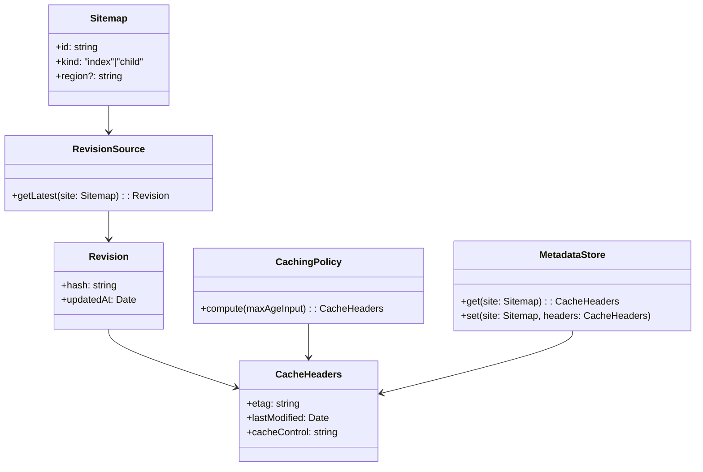

# ドメインモデル: Sitemap ETag/TTL最適化

## コンセプト
- Sitemap: 生成対象のXML（インデックス/子含む）。
- Revision: コンテンツ更新の論理バージョン（最新値は `contents_revisions` に格納）。
- RevisionSource: D1上のリビジョン算出元（テーブル/ビュー）。
- CachingPolicy: 更新頻度に応じて `Cache-Control` を決めるポリシー。
- MetadataStore: 直近成功メタ（ETag/Last-Modified）を格納（KV等、任意）。

## 不変条件
- 同一リビジョンに対して同一ETag/Last-Modifiedを返す。
- 異なるリビジョンでETagが変化する。
- 機密情報をハッシュに含めない。

## ポリシー例
- 直近更新からの経過時間に応じて `s-maxage` を段階的に増加（例: 5分→1時間→1日→7日）。

