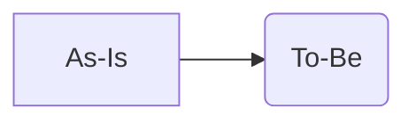

# 要求テンプレート（タイトルを置換）

## 背景 / 文脈

- 何が困りごとか、なぜ今か。
- 関連する事業/施策/OKR など。

## 目的 / ゴール

- この要求によって達成したいこと（ビジネス/ユーザー価値）。

## 利害関係者

- ユーザー、運用者、他システム、スポンサーなど。

## スコープ（含む/含まない）

- 含む:
- 含まない:

## 制約 / 前提

- 技術、運用、法務、インフラ（Cloudflare Pages + D1 など）。

## 成功基準（暫定）

- 計測可能なアウトカムやガードレール。

## 参考図（任意）

