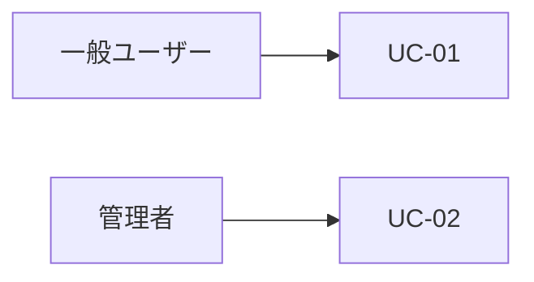
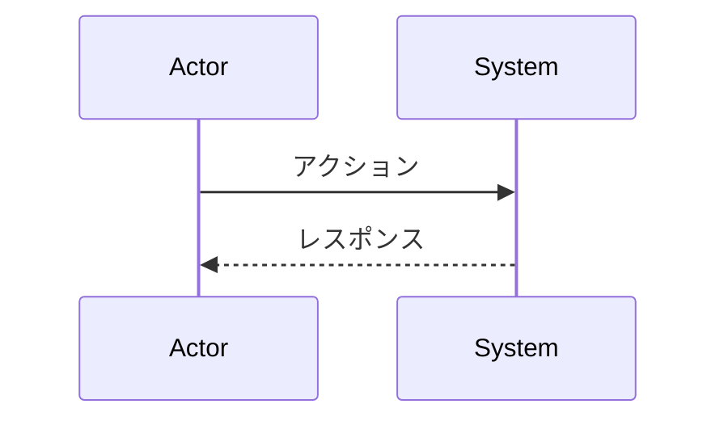

# ユースケーステンプレート（タイトルを置換）

## アクター

- 一般ユーザー
- 管理者
- 外部システム（任意）

## ユースケース一覧

- UC-01: ・・・
- UC-02: ・・・

## 関係図（簡易）

## UC-01 基本/代替フロー

- 基本: …
- 代替: …

## UC-02 基本/代替フロー

- 基本: …
- 代替: …

## 必要に応じた詳細シーケンス

