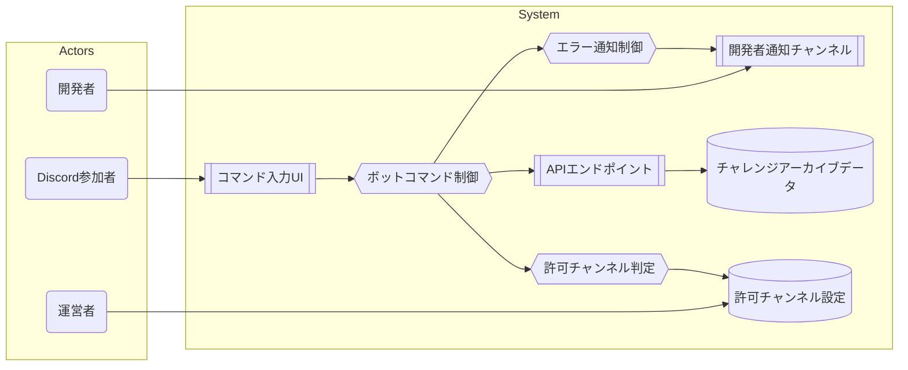

# チャレンジアーカイブ Discord コマンド登録: ユースケース

## ユースケース図

## UC1: チャレンジアーカイブを登録する

- アクター: Discord参加者
- 前提条件: 許可チャンネルであること、Bot/APIが稼働、必要な権限が付与されていること
- トリガー: `/archive-challenge` コマンドを送信
- 基本フロー:
  1. 参加者が title・url・(任意) description を指定してコマンドを実行する
  2. Bot が許可チャンネル判定を行い、有効な場合に API へリクエストを送信する
  3. API が重複判定・OGP取得を行い、チャレンジアーカイブデータを D1 に保存する
  4. API が成功応答を返すと、Bot は「アーカイブに登録しました」と公開メッセージを投稿する
  5. Bot と API は `correlationId` を含む構造化ログを出力する
- 代替フロー:
  - AF1: description 未入力時に OGP 取得が成功すれば、OGP の description を利用して保存する
  - AF2: OGP 取得が失敗した場合、API は `failed-get-ogp` で 500 を返し、Bot は共通エラー文言を返信し開発者通知を送る
  - AF3: 重複 URL (`duplicated-url`) の場合、API が 400 を返し、Bot は「登録済みのアーカイブなので、スキップしました」と返信する
  - AF4: サポート外 URL (`unsupported-url`) の場合、API が 400 を返し、Bot は対応する警告メッセージを返信する
  - AF5: 許可外チャンネルで実行された場合、Bot は警告メッセージを返し処理を終了する（API は呼び出さない）
  - AF6: API 呼び出しに失敗した場合、Bot は「アーカイブ追加に失敗しました」と返信し、エラーログを出力する

## UC2: 500 エラー通知を受け取る

- アクター: 開発者
- 前提条件: `DISCORD_DEV_ALERT_CHANNEL_ID` が設定され、Bot が通知チャンネルに投稿できること
- トリガー: UC1 の AF2 などで 500 エラーが発生
- 基本フロー:
  1. Bot がエラー検知時に開発者チャンネルへ `errorCode` と `correlationId` 等を含む通知を送る
  2. 開発者が通知を確認し、ログを参照して原因調査・復旧対応を行う

## UC3: 許可チャンネル設定を更新する

- アクター: 運営者
- 前提条件: `DISCORD_ALLOWED_CHALLENGE_ARCHIVE_CHANNEL_IDS` を更新できる環境が整備されている
- トリガー: チャレンジアーカイブ専用チャンネルの追加・変更
- 基本フロー:
  1. 運営者が対象チャンネル ID を環境変数に追加・更新し、Bot を再デプロイまたは再起動して反映する
  2. Bot が更新された設定を読み込み、該当チャンネルでコマンドを受け付ける
  3. 動作確認としてテスト投稿を行い、結果が想定通りであることを確認する
