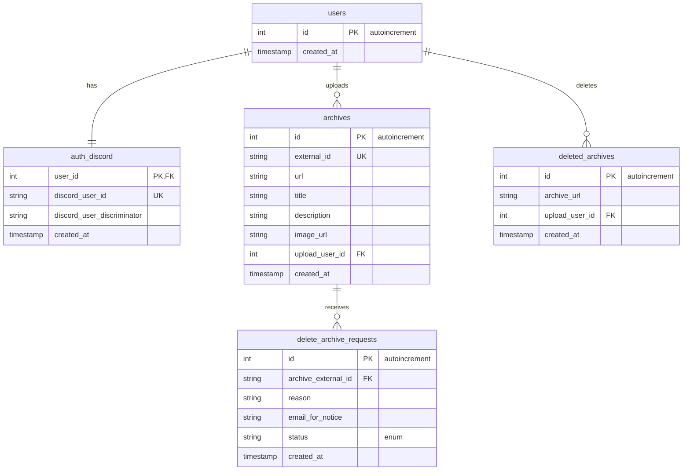

# データ定義

## ER図

```mermaid
erDiagram
    users ||--|| auth_discord : "has"
    users ||--o{ archives : "uploads"
    users ||--o{ deleted_archives : "deletes"
    archives ||--o{ delete_archive_requests : "receives"

    users {
        int id PK "autoincrement"
        timestamp created_at
    }

    auth_discord {
        int user_id PK, FK
        string discord_user_id UK
        string discord_user_discriminator
        timestamp created_at
    }

    archives {
        int id PK "autoincrement"
        string external_id UK
        string url
        string title
        string description
        string image_url
        int upload_user_id FK
        timestamp created_at
    }

    delete_archive_requests {
        int id PK "autoincrement"
        string archive_external_id FK
        string reason
        string email_for_notice
        string status "enum"
        timestamp created_at
    }

    deleted_archives {
        int id PK "autoincrement"
        string archive_url
        int upload_user_id FK
        timestamp created_at
    }
```
