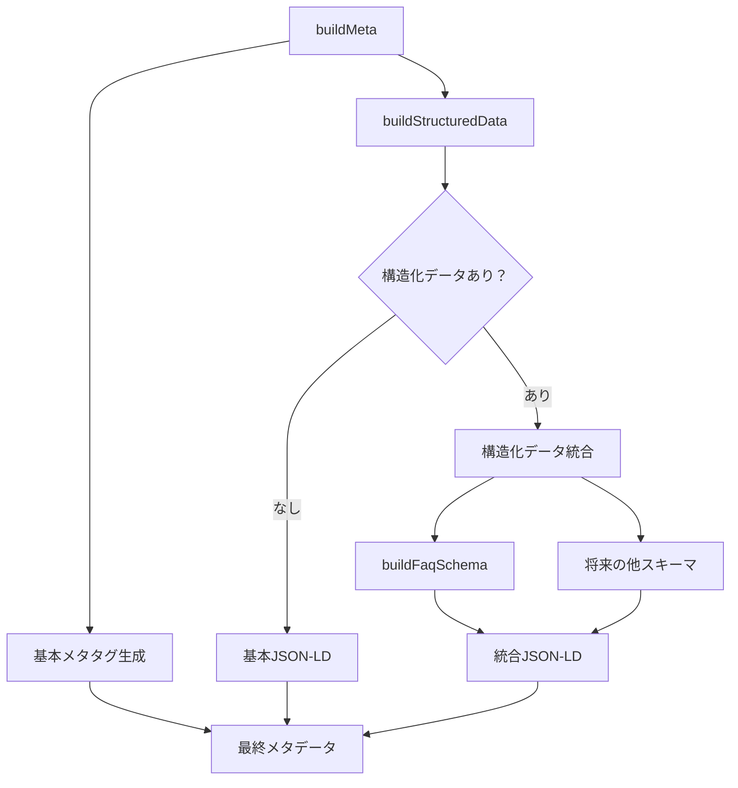

# Head Meta データ生成システム

このディレクトリには、Reactアプリケーションのメタデータ（SEO、構造化データ）を生成するためのモジュールが含まれています。

## アーキテクチャ概要

```txt
lib/head/
├── build-meta.ts              # メインエントリーポイント
├── structured-data/           # 構造化データ専用モジュール
├── test-helpers/              # テスト用ヘルパー関数
└── test-fixtures/             # テスト用モックデータ
```

## ファイル構成と役割

### メイン機能

#### `build-meta.ts`

- **役割**: アプリケーションのメタデータ生成のメインエントリーポイント
- **責任**: 基本的なSEOメタタグ + 構造化データの統合
- **公開関数**:
  - `buildMeta(args: BuildMetaArgs): Meta` - 基本メタデータのみ
  - `buildMeta(args: BuildMetaWithStructuredDataArgs): Meta` - 構造化データ付き

```typescript
// 基本的な使用例
const meta = buildMeta({
  title: 'ページタイトル',
  description: 'ページ説明',
  pathname: '/example',
})

// 構造化データ付きの使用例
const meta = buildMeta({
  title: 'ページタイトル',
  description: 'ページ説明',
  pathname: '/example',
  structuredData: {
    faq: faqData,
  },
})
```

### 構造化データモジュール

#### `structured-data/index.ts`

- **役割**: 構造化データ機能の公開API
- **エクスポート**: 型定義、ヘルパー関数、メイン処理関数

#### `structured-data/types.ts`

- **役割**: 構造化データ関連の型定義
- **定義**:
  - `FaqEntry`: FAQ項目の型
  - `BreadcrumbEntry`: パンくずリストの型（将来用）
  - `StructuredDataOptions`: 構造化データオプションの統合型
  - `JsonLdSchema`: JSON-LDスキーマの型

#### `structured-data/faq.ts`

- **役割**: FAQ構造化データの生成
- **関数**:
  - `buildFaqSchema(entries)`: FAQ用JSON-LDスキーマ生成
  - `createFaqStructuredData(faqItems)`: 外部データ形式からFAQエントリーへの変換

#### `structured-data/combine.ts`

- **役割**: 複数の構造化データタイプを統合してJSON-LDを生成
- **関数**:
  - `buildStructuredData(options, args)`: メイン統合処理
- **内部関数**:
  - `buildBasicJsonLd()`: 基本的なJSON-LD生成
  - `buildJsonLdWithStructuredData()`: 構造化データ付きJSON-LD生成
  - `buildOrganizationSchema()`: Organization スキーマ
  - `buildWebPageSchema()`: WebPage スキーマ
  - `buildWebSiteSchema()`: WebSite スキーマ

### テスト関連

#### `test-helpers/structured-data.ts`

- **役割**: テスト用の共通ヘルパー関数
- **関数**:
  - `findJsonLdSchema()`: メタデータからJSON-LDスキーマを抽出
  - `findWebPageNode()`: WebPageノードを検索
  - `expectValidJsonLd()`: JSON-LDの基本構造をテスト
  - `expectFaqSchema()`: FAQスキーマの検証
  - `hasStructuredData()`: 構造化データの有無をチェック

#### `test-fixtures/structured-data.ts`

- **役割**: テスト用のモックデータ
- **データ**:
  - `mockFaqData`: 複数のFAQエントリー
  - `mockSingleFaqData`: 単一のFAQエントリー

## データフロー



## 新しい構造化データタイプの追加方法

### 1. 型定義の追加

```typescript
// structured-data/types.ts
export type ProductEntry = Readonly<{
  name: string
  price: number
  // ...
}>

export type StructuredDataOptions = Readonly<{
  faq?: FaqEntry[]
  product?: ProductEntry[] // 追加
  // ...
}>
```

### 2. スキーマ生成関数の作成

```typescript
// structured-data/product.ts
export function buildProductSchema(entries: ProductEntry[]): JsonLdSchema[] {
  return entries.map((product) => ({
    '@type': 'Product',
    name: product.name,
    offers: {
      '@type': 'Offer',
      price: product.price,
    },
  }))
}
```

### 3. 統合処理への追加

```typescript
// structured-data/combine.ts
import { buildProductSchema } from './product'

function buildJsonLdWithStructuredData(...) {
  // ...
  if (options.product) {
    schemas.push(...buildProductSchema(options.product))
  }
  // ...
}
```

### 4. テストの追加

```typescript
// structured-data/product.spec.ts
describe('Product structured data', () => {
  it('should generate valid product schema', () => {
    // テスト実装
  })
})
```

## テスト戦略

### 階層化されたテスト構造

1. **統合テスト** (`build-meta.spec.ts`)
   - 基本メタタグの生成確認
   - 構造化データの統合確認

2. **個別機能テスト** (`structured-data/*.spec.ts`)
   - 各構造化データタイプの詳細テスト
   - エッジケースの検証

3. **統合処理テスト** (`combine.spec.ts`)
   - 複数構造化データの組み合わせテスト
   - JSON-LD生成ロジックのテスト

### テスト肥大化の防止

- **パラメータ化テスト**: 同様のテストパターンを効率化
- **ヘルパー関数**: 共通検証ロジックの再利用
- **モックデータ**: テストデータの一元管理

## 使用例

### ルートでの基本使用

```typescript
// routes/example.tsx
import { buildMeta } from '~/lib/head/build-meta'

export const meta: Route.MetaFunction = ({ location }) => [
  ...buildMeta({
    title: 'ページタイトル',
    description: 'ページ説明',
    pathname: location.pathname,
  }),
]
```

### FAQ付きページ

```typescript
// routes/faq.tsx
import { buildMeta } from '~/lib/head/build-meta'
import { createFaqStructuredData } from '~/lib/head/structured-data'

const faqItems = [
  { question: 'Q1', answerText: 'A1' },
  { question: 'Q2', answerText: 'A2' },
]

export const meta: Route.MetaFunction = ({ location }) => [
  ...buildMeta({
    title: 'よくある質問',
    description: 'FAQ説明',
    pathname: location.pathname,
    structuredData: {
      faq: createFaqStructuredData(faqItems),
    },
  }),
]
```

## 設計原則

1. **単一責任の原則**: 各モジュールは特定の構造化データタイプを担当
2. **拡張性**: 新しい構造化データタイプを既存コードに影響なく追加可能
3. **型安全性**: TypeScriptによる厳密な型チェック
4. **テスト可能性**: 各機能を独立してテスト可能
5. **保守性**: 明確な責任分界と依存関係

## パフォーマンス考慮事項

- 構造化データが不要な場合は基本JSON-LDのみ生成
- 条件分岐により不要な処理をスキップ
- テストでの重複処理を最小化
